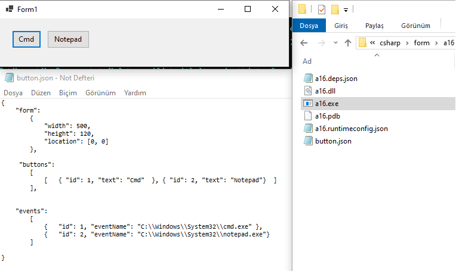
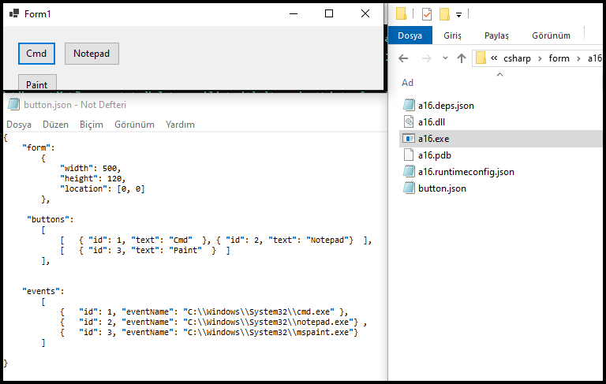

# 📂 portfolyo
> [!A]
> ✨Yaptığım Projeler 
  
> [!NOTE]
> ✨Yaptığım Projeler 
  
| ✨ Parametre | 📌 Açıklama|
|---------------|-------------------|
| _**form**_      | _pencere hakkında_|
| `width: 500`       | _pencere genişliği_|
| `height: 120`      | _pencere yüksekliği_|
|`location:[0, 0]`     | _pencere konumu_|
| _**button**_  | _butonlar_|
| _**events**_    | _çalıştırılacak programlar_|
| `eventName` | _çalıştırılacak program_|
<br>
<br>

> [!TIP]
>  ✨✨<ins>**Örnek1 Button.json**</ins> 

``` 
{ 
    "form": 
	{
            "width": 500,
            "height": 120,
            "location": [0, 0]
    	},

     "buttons":
	[  
	    [   { "id": 1, "text": "Cmd"  }, { "id": 2, "text": "Notepad"}  ]
    	],
    
    
    "events": 
	[
            {   "id": 1, "eventName": "C:\\Windows\\System32\\cmd.exe" },
            {   "id": 2, "eventName": "C:\\Windows\\System32\\notepad.exe"}
    	]

}
```
<br>

> [!NOTE]
> 📌**Programın Çalışma Örneği**


<br>
---
<br>
<br>

> [!TIP]
>  ✨✨<ins>**Örnek2 Button.json**</ins> 

``` 
{ 
    "form": 
	{
            "width": 500,
            "height": 120,
            "location": [0, 0]
    	},

     "buttons":
	[  
	    [   { "id": 1, "text": "Cmd"  }, { "id": 2, "text": "Notepad"}  ],
	    [   { "id": 3, "text": "Paint"  }  ]
    	],
    
    
    "events": 
	[
            {   "id": 1, "eventName": "C:\\Windows\\System32\\cmd.exe" },
            {   "id": 2, "eventName": "C:\\Windows\\System32\\notepad.exe"} ,
            {   "id": 3, "eventName": "C:\\Windows\\System32\\mspaint.exe"} 
    	]

}
```

<br>

> [!NOTE]
> 📌**Programın Çalışma Örneği**



<br>